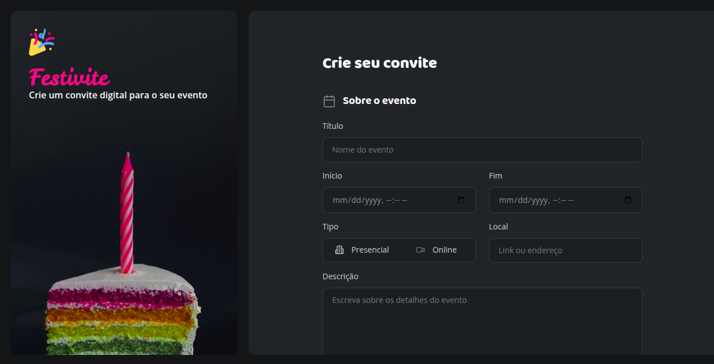

<h1>Formulário de Convite ✨</h1>

Um formulário de convite estilizado para eventos especiais, criado para praticar CSS moderno.

<h2>Descrição</h2>

O projeto <strong>Formulário de Convite</strong> foi desenvolvido como parte dos estudos do curso Fullstack da Rocketseat. O principal objetivo foi treinar a estilização de formulários HTML com foco em inputs personalizados, botões, labels e layout geral da interface.

O layout foi elaborado no Figma pela equipe da Rocketseat e toda a implementação visual foi feita com HTML5 e CSS3, sem uso de JavaScript. Também foram aplicadas práticas modernas de usabilidade e acessibilidade.

Você pode visualizar o projeto publicado no GitHub Pages <a href="https://annabeatrizpereira.github.io/formulario-convite/">aqui.</a>

<h2>Tecnologias</h2>

 
<small>Thank you for reading! ❤️</small>
